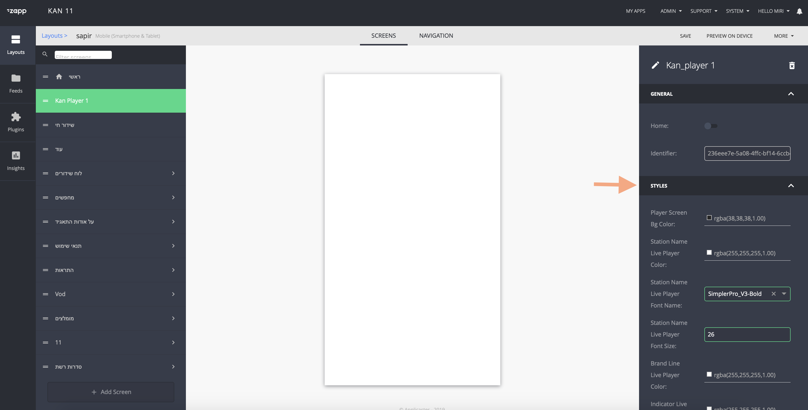

# Zee5 Player Plugin

### About

a custom-made player, based on applicaster player with extensive capabilities. The player has three modes: inline (portrait), landscape and mini (sticky). 

Is intended only to be used by customer Zee5.
Developed by Israel team. 

The player support the following features:

* Share

* Chromecast

* Sleep mode - popup with option to stop the player after x minutes, for audio it is stop while the app is in the BG.

* Device rotation (video only) - move to full screen video when rotating the device to landscape and return to portrait mode when rotating to portrait.

* Swipe the player from portrait view to sticky player and the opposite. 

* Audio plays when the app is in the background.

* Persistent resume - without UI, start the player in the last stop. 


### Developer information: 

1. The player defined is Applicaster player.

2. It is a screen plugin. 

3. The player is supported in 3 modes:

   1. Portrait player: small player with extra metadata and list of related video/audio below, are taken from the extension of the playable model. 
   2. Full screen player: The player appears on a full screen in Landscape (Video only).
   3. Mini player: The player appears on the mini view displayed for all screens in app.

4. Move to full screen video when rotating the device to landscape and return to portrait mode when rotating to portrait or by click on buttons designated for this.
Move from the portrait player to mini player mode by swiping down the top of the player or by the button designated for it.

   To switch to mini player mode, the root plugin should implement the following protocol:
   ```ZAAppDelegateConnectorStickyViewProtocol```

   With this method: 
      ```func stickyViewDisplay(view: UIView?)```

   To desplay the view on the RootViewController

   And you need to send the desired view from the player to Root plugin with the following command:
   ```ZAAppConnector.sharedInstance().stickyViewDelegate.stickyViewDisplay(view: miniPlayerView)```
   
5. Each player has its own controls view.


### User information - configuration: 


#### Plugin configuration: 

Configured on the plugin configuration.


* show_screen_id - UI Builder screen id to use for opening related feeds.

* sleep_mode_title - title for the sleep mode popup.

* sleep_mode_interval - list of numbers in minutes that indicate the interval for the sleep mode.

* sleep_mode_close_title - title for the sleep mode popup close button.

* recommendations_limit - number of items to display in the recommendation items ( default 8 ).

* next_program_title - the title for the next program (`מיד אחר כך` is the default)


### Styles: 

The player is a screen plugin and you can configure it on the app builder screen. 
Keys are here: 
https://zpl.io/aMP5AE3 (private)




### Assets: 

Assets are upload by developer to the plugin. 


